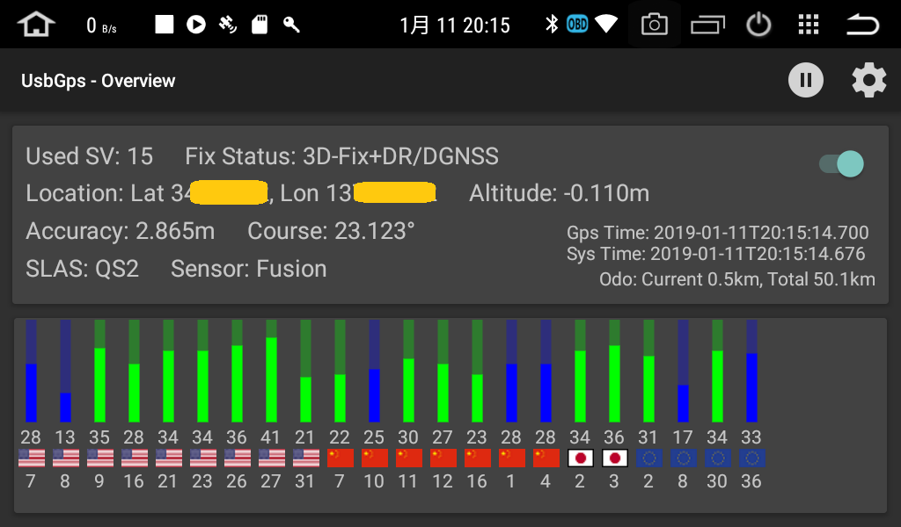

# UsbGps4Droid - For U-blox NEO-M8U

 freshollie氏のUsbGps4DroidをU-blox NEO-M8U向けに改造しました。  
 UBXバイナリを解析することで、NEO-M8U独自の高レートナビゲーションを疑似ロケーションに反映することができます。

[Download latest release](../../releases)

## スクリーンショット

## 変更点
* Android Head Unit(中華ナビ)向けの変更
  * MTCManagerによるKill対策
    * SLEEP開始時に特定のパッケージ名以外のアプリが自動起動不可となるため  
  アプリのパッケージをcom.microntek.\*に変更
  * SLEEP対応
    * SCREEN_ONのインテントを受信した場合にサービスを自動できるように変更
  * 自動起動高速化

* 全般
  * NMEAパーサーの廃止
  * UBXパーサーの追加
    * UBX-HNR-PVT
    * UBX-NAV-PVT  
    * UBX-NAV-ODO
    * UBX-NAV-SVINFO
    * UBX-NAV-SLAS
    * UBX-ESF-STATUS

* レイアウト
  * アクションバー上でログの記録開始／停止を行えるように変更
  * 上部レイアウトに以下の項目を追加
    * 測位状態  
    * 進行方位  
    * センサーの状態  
    * SLAS（サブメータ級測位）の状態  
    * ODOメータ
  * 下部のレイアウトに各衛星の測位状態を表示  
    * 信号強度、衛星種類、衛星番号の順で表示しています。  
      ナビに使用している衛星はグラフが緑色になります。  

* ナビゲーション
  * 疑似ロケーションへの反映設定を追加
    * Use Ground Speed - 速度の反映有無
      * 一部のナビソフトはこの値を使用して位置情報を補完します。  
      (Yahoo!カーナビ等)
    * Use Accuracy - 精度の反映有無
      * 一部のナビソフトはこの値をしようして位置情報の使用可否を判定します。
        無効にした場合は水平方向の精度のみ1m固定になります。  
      (Yahoo!カーナビ、GoogleMaps等
    * Use UBX-HNR-PVT - UBX-HNR-PVTの位置情報反映有無
      * 無効にした場合はUBX-HNR-PVTのバイナリを無視します。（USB側の設定変更は行いません）

* UsbGPS側の設定変更
  * config UBX-CFG-HNR - 高ナビレートの変更
    * 0 ~ 30を指定した場合、通信開始時に設定変更コマンドをUSBに送信します。  
    -1を指定した場合は、コマンドは送信しません。
  * config UBX-NAV-RESETODO - ODOメータのリセット
    * 有効にした場合、通信開始時にODOメータのリセットコマンドをUSBに送信します。

## 動作確認環境
* Android
  * Nexus7 2013(Android6.0)  
  * Dasaita Android Head Unit(Android8.0)  

* USBGP
  * DROTEK Ublox NEO-M8U GPS + LIS3MDL compass (XL)  

## その他
* NEO-M8U側はUBXのみ出力するように変更することを推奨します。  
* UBX-NAV-ODOはデフォルトでは無効になっているのでODOメータの表示が必要な場合は有効化してください。  
* 高レートで使用する場合はボーレートを115200にすることを推奨します。
* NEO-M8U向けですが、U-bloxのM8シリーズなら使えるはずです。  
* USBの権限確認ダイアログは以下を参考にすると回避可能  
https://stackoverflow.com/questions/13726583/bypass-android-usb-host-permission-confirmation-dialog/30563253#30563253  
なお、中華ナビのOreo機でSystemUI.apkを書き換える場合は、Malysk氏のカスタムロムを適用するとvdex、odexを気にしなくて良くなるので楽です。  
`GPL v3`
