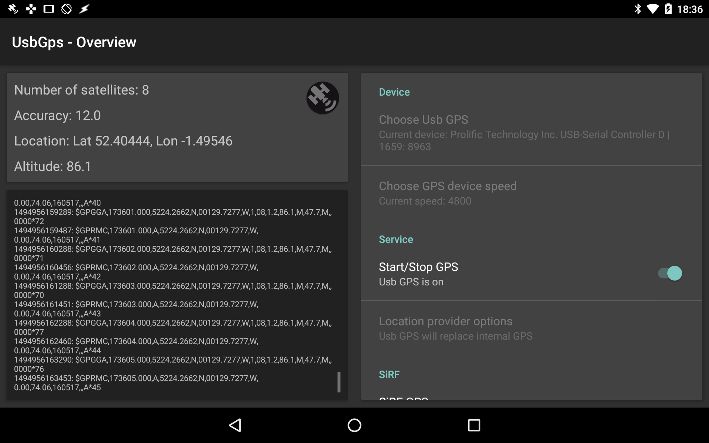
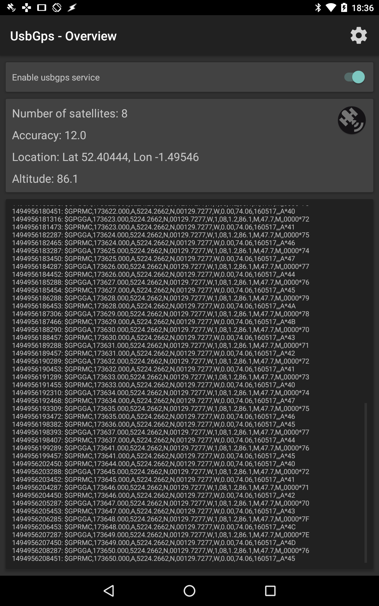
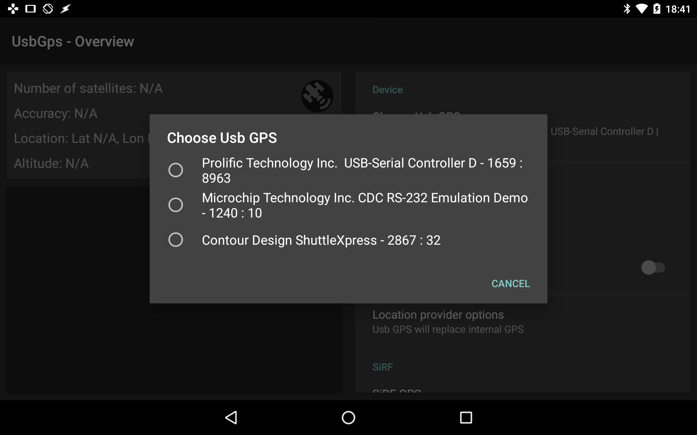

# UsbGps4Droid

## Builds

Download the latest APK from [here](/app/build/outputs/apk/) (Android 3.1 and higher)

## About

UsbGps4Droid is an USB Gps driver and settings UI for the android operating system.

The driver will provider location updates to android internal GPS and such requires mock location enabled.

Originally written by Herbert von Broeuschmeul, and I have taken over maintaining the project. I have fixed several bugs with the main algorithm with current android operating systems.

## Disclaimer

This app has only been tested on 2 of my devices, running 5.1 and 6.0. Any issues with this app on your device, please make an issue and I will resolve as soon as possible.

## Current Development

The current updates include:

### 2.1
- Added option to start service on bootup
- Added option to set the system clock to the gps clock (10 seconds after connecting the clock will be set)
- Other code fixes

### 2.0

- Added information interface which shows the log of information being received from the GPS device.
- Updated device selection settings
- Fix to algorithm to pick the correct device from the USB device list
- Fix to connection baud rate settings
- Updated NMEA recording to be enabled to start when service starts.
- Fixed auto-reconnecting
- Dialog popups in app for problems
- Compatibility down to android 3.1


## Usage

The driver works with SiRF and allows the user to log more than just location data to NMEA when enabled.

The app will not start automatically when the device connects.

The best implementation is to start the service in the background. (This can be done through tasker as root)

```bash
am startservice -a org.broeuschmeul.android.gps.usb.provider.nmea.intent.action.START_GPS_PROVIDER
```

Be sure to call this only once the GPS device is connected as the app will not wait for it to be connected.

The service will automatically close itself when the USB device is disconnected for too long.

## Contributing

To help with development simply clone the repository, create your branch and then import the project into android studio (File -> New -> Import Project)

It should build perfectly, providing you have the correct SDKs (Currently SDK 25 required)

## Screenshots


### Main interface

#### Landscape tablet
<p align="center">
    
</p>

<p align="center">
    
</p>

#### Portrait
<p align="center">
    
</p>

#### Device selection
<p align="center">
    
</p>